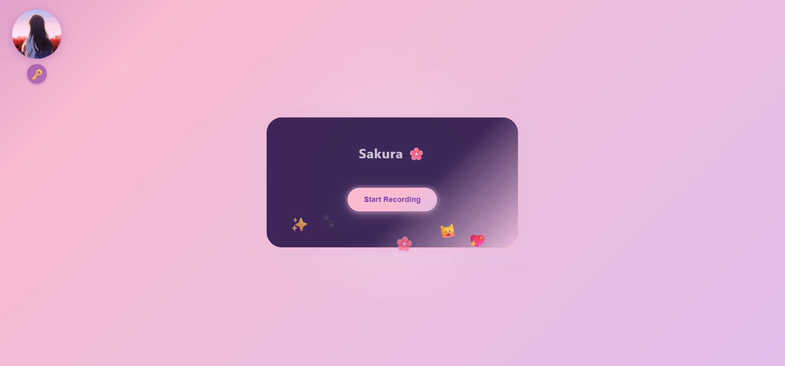

# 🌸 Sakura: Your Real-Time Voice AI Companion


Konnichiwa~! 🌸  
Welcome to **Sakura**, your gentle and emotionally intelligent voice companion! She listens with care, responds with warmth, and chats in real-time with her own adorable voice—all right in your browser.

Let Sakura brighten your day with cozy conversations, live weather updates, real-time web search, and a sprinkle of cuteness! 💖

---

## ✨ Features You'll Love
- 🌸 **Adorable Sakura UI:** Cozy pastel gradients, soft dark mode, and a glowing, pillowy chat container.
- 💖 **Breathing Animations:** Relaxing, rhythmic breathing for Sakura’s avatar and chat box.
- 🐾 **Animated Emoji Sparkles:** Floating emojis (✨ 💖 🌸 🐾 🐱) that drift around playfully.
- 🎀 **Cute Modal Dialogs:** Rounded pastel popups for API key input, summoned by a kawaii button.
- 🫧 **Fluffy Chat Bubbles:** Soft, glowing bubbles with pastel shadows and personality.
- 🎤 **Real-Time Voice Chat:** Speak to Sakura, and she replies instantly with her sweet voice.
- 🌦️ **Live Weather Updates:** Sakura fetches real-time weather with a cheerful smile.
- 🔎 **Web Search Skill:** Ask questions—she’ll search the web for you.
- 🧠 **Gemini LLM Integration:** Persona-aware, thoughtful replies.
- 🔊 **Murf TTS Voice:** Streamed audio responses in Sakura’s unique voice.
- 🗝️ **Private API Entry:** Enter your keys safely—Sakura never stores them.
- 🌐 **Shareable & Secure:** Deployed via HTTPS (Render.com) for safe sharing.

---

## 🌸 Sakura UI Sneak Peek



So fluffy and friendly~ 💕

---

## 🌟 What's New?
- 🌸 Smooth breathing effect on avatar & container
- 🐾 Enhanced floating emoji animations
- 💖 Prettier gradient backgrounds (pastel & dark)
- 🎀 Cutified API key modal
- 🫧 Glowier chat container with pillowy edges
- 🐱 Clearer assistant bubbles
- 🎤 Animated pulsing mic button
- 📱 Fully mobile responsive + accessible!

---

## 🏗️ Architecture Overview

| Layer      | Tech Stack |
|------------|------------|
| **Frontend** | HTML, CSS, JavaScript (`index.html`, `static/script.js`) |
| **Backend**  | FastAPI (Python), Murf TTS, Gemini LLM, AssemblyAI, WeatherAPI, Tavily |
| 🧁 Bonus     | No Node.js, no `.env` files! Just start & chat 💬 |

---

## 🛠️ How to Use

### 🌸 Try Sakura Instantly
Sakura is live & ready to chat here:  
🔗 **[https://sakura-6seg.onrender.com](https://sakura-6seg.onrender.com)**  

Just open the link, enter your API keys, and say hello~ 💕

---

### 🏡 Run Sakura Locally

1. **Clone the repo:**
   ```bash
   git clone https://github.com/GhostBlade-dev/Sakura.git
   cd Sakura
   ```

2. **Install dependencies:**
   ```bash
   pip install -r requirements.txt
   ```

3. **Start the backend server:**
   ```bash
   uvicorn audio_server:app --host 0.0.0.0 --port 8000
   ```

4. **Open Sakura in your browser:**
   [http://localhost:8000](http://localhost:8000)

---

### 🔑 API Keys Needed

- 🧠 Gemini (chat LLM)  
- 🎧 AssemblyAI (speech-to-text)  
- 🔊 Murf (text-to-speech)  
- 🌦️ WeatherAPI (weather info)  
- 🔎 Tavily (web search)

Enter these in the modal or sidebar when prompted.  
🔒 Sakura doesn’t store them—they’re used just for your current session!

---

## 📡 Sakura's Magic Endpoints

| Endpoint | Description |
|----------|-------------|
| `POST /agent/chat/{session_id}` | Upload voice, get reply with audio |
| `POST /tts/gtts` | Fallback text-to-speech (gTTS) |
| `POST /tts/murf` | Murf TTS generation |
| `POST /upload-audio` | Upload audio recordings |
| `GET /uploads/{filename}` | Access audio replies |
| `GET /` | Serve frontend |

---

## 💖 Sakura in Action (Screenshots)

_Add your cute screenshots here to show off how Sakura looks and talks!_  
✨ Bonus idea: create a little comic strip of a convo with her!

---

## 📄 License

Sakura is shared with love under the **MIT License**.  
Use, remix, and make your own cozy AI friend. 🌸

---

> Made with heart by **you and Sakura**. Stay gentle, stay curious. 💕